# 线性代数随堂笔记

# 第一节课200303

Introduction

# 第二节课200305

### 几个等价的计算方式

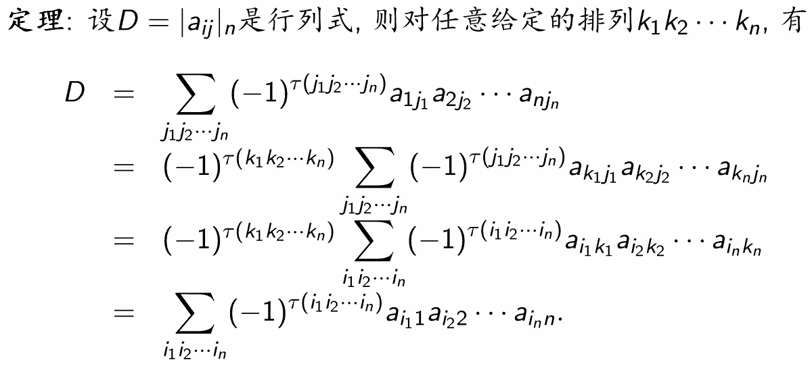

- 行排列不是自然排列的时候，需要考虑行排列引起的符号变化。

- 交换两个是改变或者不变。用两个加起来(行排列和列排列的逆序)就保证持续不变

### 前言

- 行列式的定义不方便直接计算。

- 转换成现在会算的行列式。（上下三角/二阶三阶）

### 性质

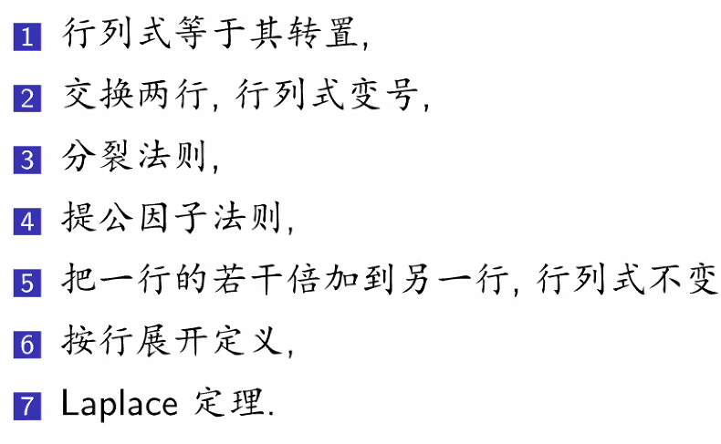

- 转置 $D^T$ 行列互换得到的行列式。

- **性质1：**对行描述的性质，自然（因为转置$D= D^T$）对列也成立。

- **性质2：**交换两行的位置，行列式变号。

- 两行如果元素相等，$D=D^` \&  D= -D^`$那么行列式为零。

- **性质3：**提公因子法则：提出来公因子。

- 如果两行对应成比列，行列式为零。

- **性质4：**某一行得个元素都是两个元素得和，那么这个行列式等于两个行列式之和。

  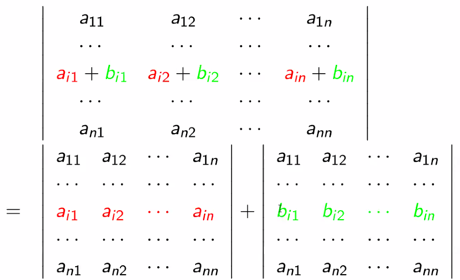

- 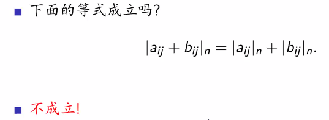

  不成立，要拆分成$2^n$个相加。

- **性质5：**某一行乘以$K$，然后加到另一行上面，行列式的值不变。

  拆成两个行列式——原来的行列式 + 一个有两行重复的行列式（提取K）= 0

  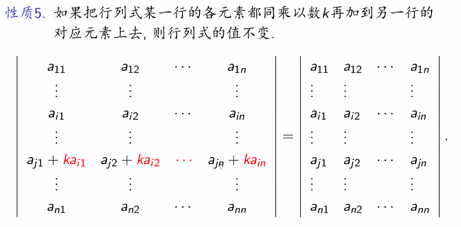

- 样例计算-转换成上三角的行列式：

  - 我们操作的时候因为书写比较复杂，可以利用`同样的性质`进行操作的时候一起都计算了。
  - 从上往下找基准行（逐行使得主对角线上前面元素都为0）。
  - 为啥要逐列分析，因为我们头一个元素已经找出来了。之后再用就会引起污染了。
  - 做完要检查。

- **余子式：**剩下的小的行列式。**代数余子式：**带上位置正负号$(-1)^{i+j}$的余子式。

- **性质6（按行展开定义）：**行列式等于任意一行所有元素与他们各自的代数余子式的乘积之和。

  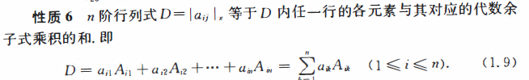

  - 三个步骤逐渐去证明✔

# 第三节课200310

### 性质6的推论

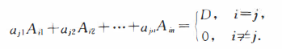

自己的就是D，和别人在一起的是0

### 行列式的计算

1. 行和相等行列式 - 把元素都加到一块去
2. 箭形行列式
3. 三对角行列式
4. Vandermonder行列式

# 第四节课

### 拉普拉斯定理

拉普拉斯把子式放大到了k*k

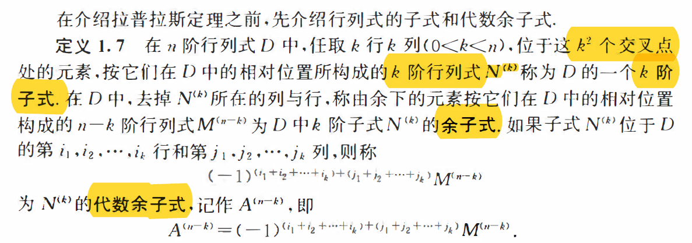

可以分开去取（比如说第2，4行，第1，4列 -> 对应的余子式，代数余子式）

**实际计算中**我们通常是取某k行(行列对称，这里只是强调是单从行或者单从列取)，列的角度需要排列组合$C_n^{k}$，然后乘积求和。

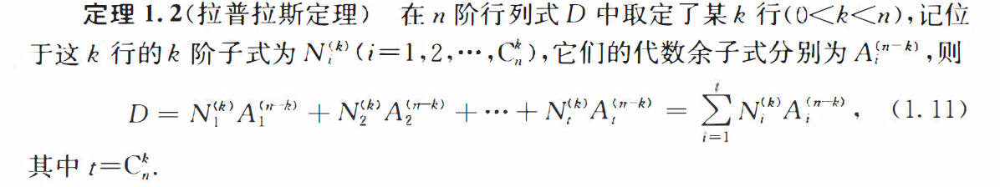

e.g.两个简单证明很显然

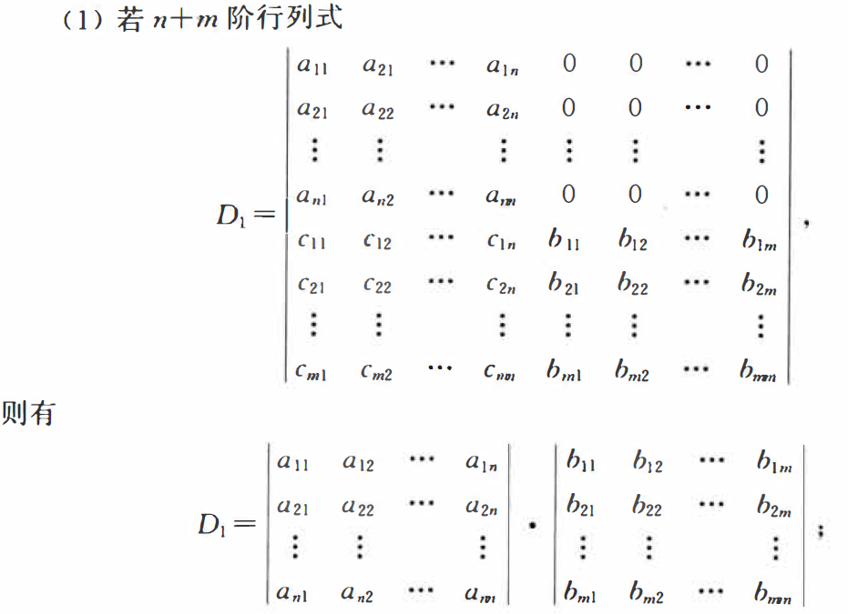

指数是我们选出来的子式的行列和 - 下面的式子注意$(-1)^{mn}$

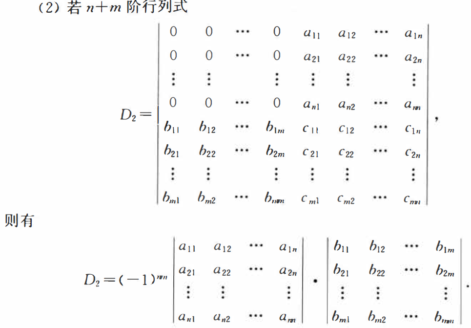

### 行列式的乘积公式

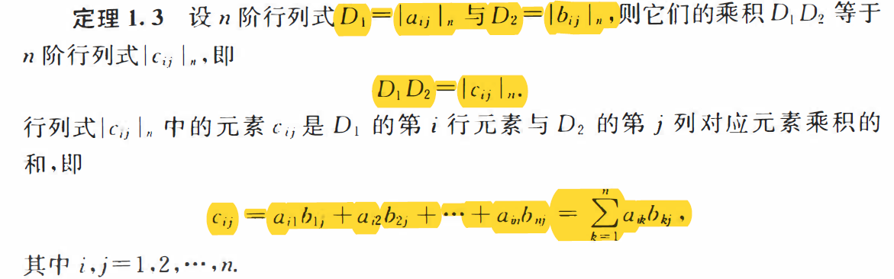

证明的过程利用了上面我们学到的两种计算的等式变换。

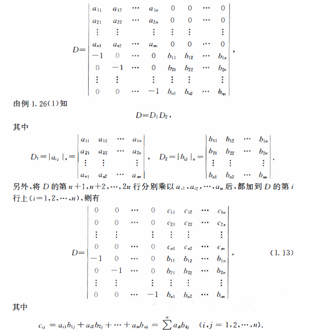

计算中我们只需要记住上面图片的最后一行就可以了。

对于 `ij` 位置的元素来说，我们对`i` 行 `j`列的元素进行乘积求和。

**例1.29**->简单的乘积计算就可以解答

**例1.30**->求行列式的平方

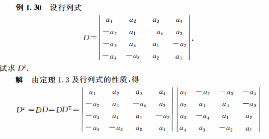

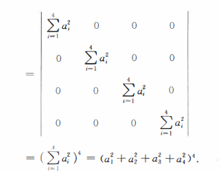

**例1.31**->证明等式

这个我们可以记住$(1-x^2)$的行列式表示形式。

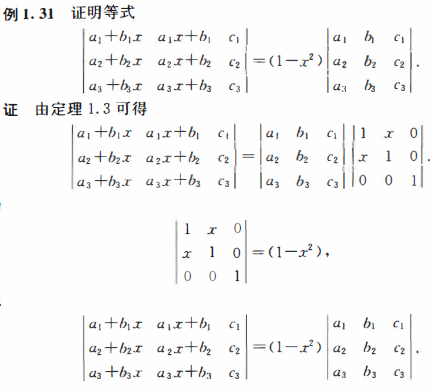

### 克拉默定理

`n 元线性方程组` 中的 `系数行列式` 不等于 0 -> 有唯一解

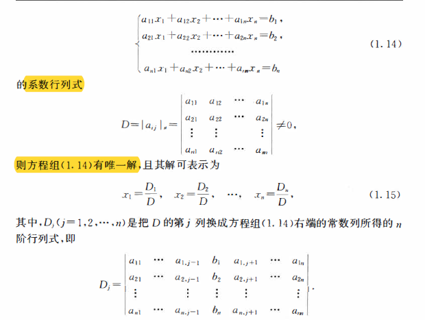

**例1.32**->判断方程组是否有唯一解问题 —— 转换为我们去计算系数行列式是否为0问题。

**例1.33**->复杂系数行列的计算 —— 和前面问题的结合

**n元齐次线性方程组** —— 常熟全为0

**n元非齐次线性方程组** —— 常数不全为0

**例1.34**->有非零解求常数的值——转换不等于零的条件——一般是利用平方大于等于零的性质 or 因式分解

**例1.35**->利用行列式来解方程——利用有唯一解的时候，唯一解的公式进行计算。

# 第五节课200318

线性方程组不改变解。

### **矩阵**

- 方阵 - 行列式
- 只有一行的矩阵——行矩阵/行向量
- 只有一列的矩阵——列矩阵/列向量
- 单位矩阵(E/I) | 零矩阵 | 对角矩阵 | 数量矩阵（主对角元全相等）
- 矩阵的相等：1. 同类型矩阵 2. 对应元素

### 加减法

**同类型矩阵**（行数、列数相等） **对应元素**的加减

1. 交换律、结合律
2. $A+O=O+A=A$
3. $A+(-A)=O$（负矩阵的存在）

### 数乘

与一个**数**的乘法。 数乘到每一个位置上面去。

1. $1A=A$
2. $K(lA)=(Kl)A$
3. $K(A+B)=KA+KB$
4. $(k+l)A=kA+lA$

方程组的**向量组**记法： $x_1\alpha_1+x_2\alpha_2+···+x_n\alpha_n=\beta$

### 矩阵乘法

$AB=C$

$A=(a_{ij})_{m*p}$, $B=(b_{ij})_{p*n}$, $C=(c_{ij})_{m*n}$

方程组的**矩阵乘积**记法： $AX=\beta$

- 矩阵乘法不满足交换律

- 如果$AB=BA$，可交换

  - 单位矩阵和任何同阶方阵可交换
  - 数量矩阵和任何同阶方阵可交换

- **零因子**$A\neq O,B\neq O,AB=O$ ：两个非零矩阵的乘积可能是零矩阵

- 不满足**消去律**

- 结合律 $(AB)C=A(BC)$

- 左右分配律 

  $A(B+C)=AB+AC$

  $(A+B)C=AC+BC$

- 数乘结合律

- 单位元素 $E_mA_{n*m}E_n$=$E_mA_{m*n}$=$A_{m*n}E_n$=$A_{m*n}$

- 零矩阵的作用

- 方阵乘积的行列式 $|AB|=|A||B|$

- 记号统一性

**乘积法则**特别强调仿真

**左高右胖行列式等于零**

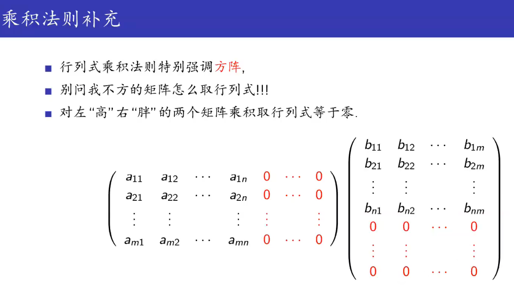

**例2.5**->强调左乘和右乘的存在不同：数值，甚至有可能维度都不同。

一些运算性质：

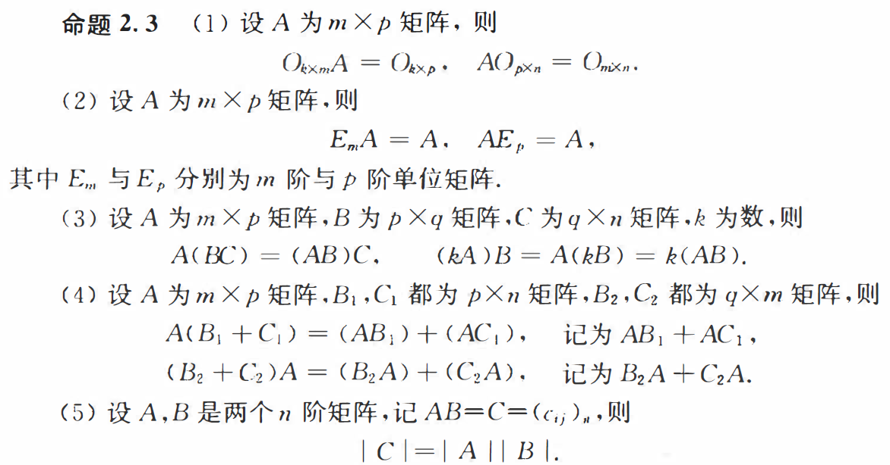

##### 可以交换的矩阵乘法

- 单位矩阵、数量矩阵
- 可逆矩阵
- 同阶对角矩阵

### 矩阵的幂

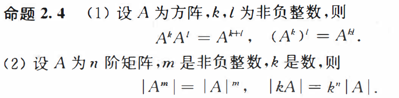

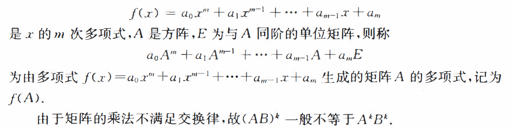

方幂中存在交换律（结合律带来的）
$$
A^0=E
$$

**例2.7**

- 对于矩阵的幂，如果没有啥思路，我们可以先计算一个$A^2$

- 当然如果有思路，我们最好是把矩阵进行分解，然后中间项乘完变成常数。

  [n*1] * ([1*n] * [n*1]) * (...) * [1*n]

**例2.**8->

##### 方阵的多项式

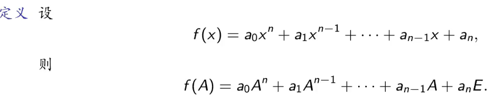

### 矩阵的转置

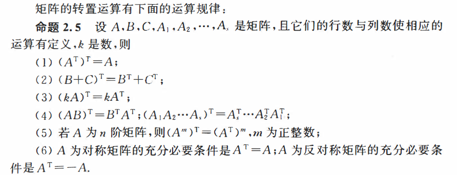

对称阵是方阵【类型的角度来看】

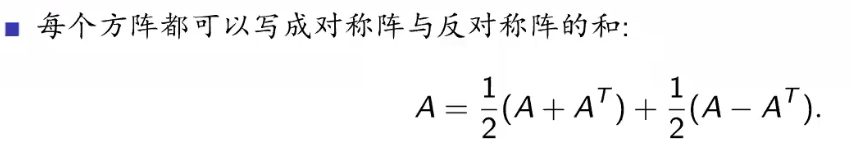

**例2.9**->证明是对称矩阵，并且平方为单位矩阵。

- 利用对称矩阵形式（$B=B^T$）我们就直接去找 $B^T$
- 计算平方$B^2=BB$

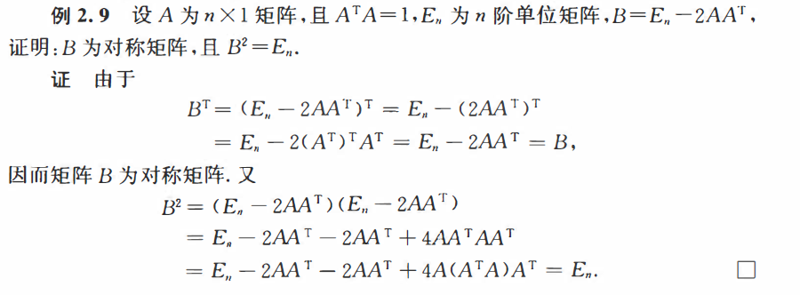

# 第六节课200323✔

### 矩阵的共轭

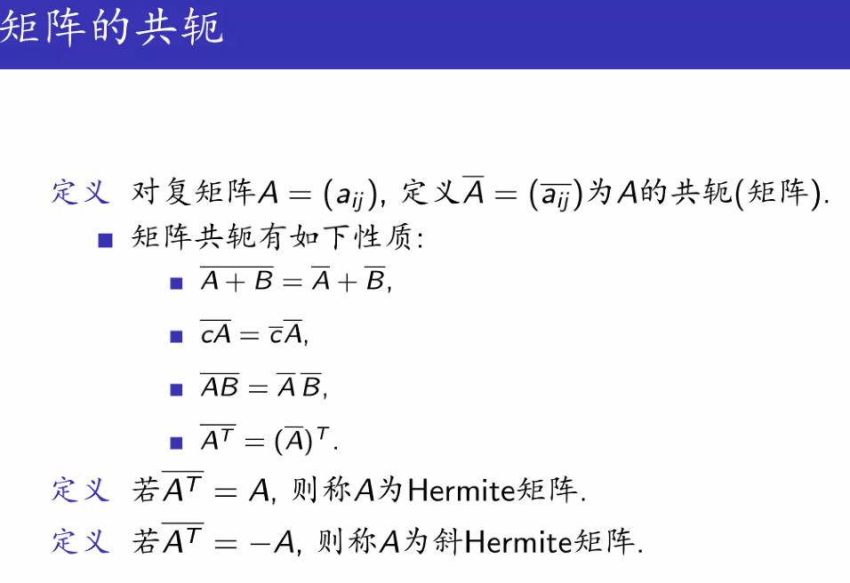

对于矩阵乘法：

- 实矩阵[1*n] * [n*1] 可以推出每一项都为0
- 复矩阵：乘共轭=0 ： 可以推出是0

### 可逆矩阵

解方程的时候我们有一个美好的想法，类似于之前代数式子进行计算。

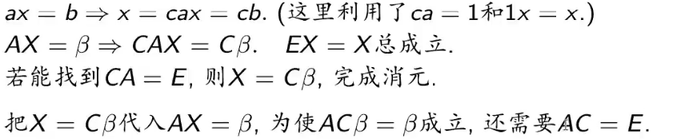

因为有AC,CA所以我们需要矩阵是可逆的。

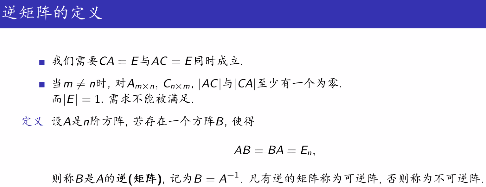

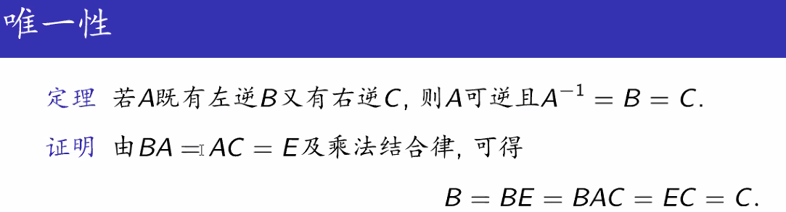

- 逆矩阵是唯一的

  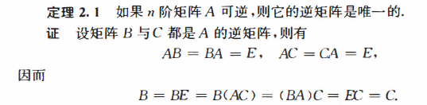

单位矩阵的定义：

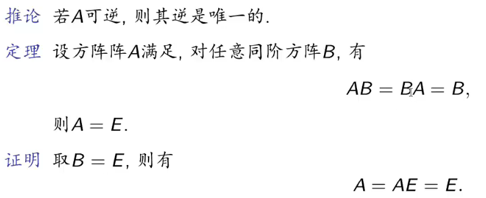2

- 伴随矩阵

  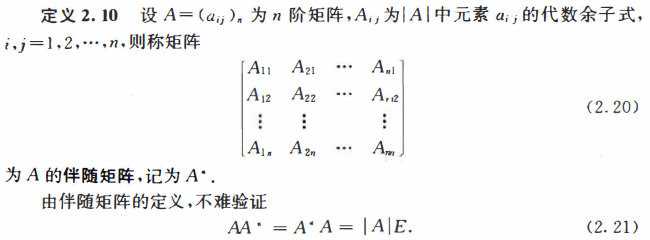

  伴随矩阵重要：代数余子式 + 乘积的性质

  **需要注意到伴随矩阵的方向是转过来的**

**A可逆**的充分必要条件：$|A|\neq0$

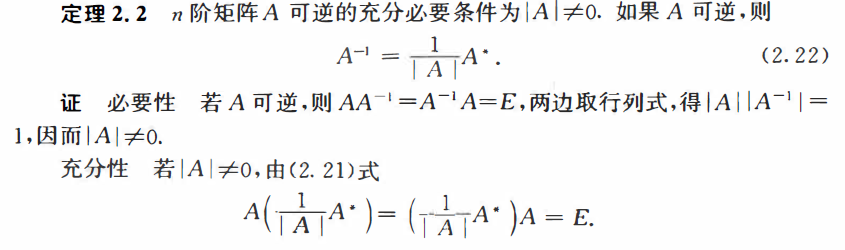

**非奇异矩阵（行列式不为0）**和**可逆矩阵**等价的概念。

##### **伴随矩阵法**求矩阵的逆：二阶比较简单

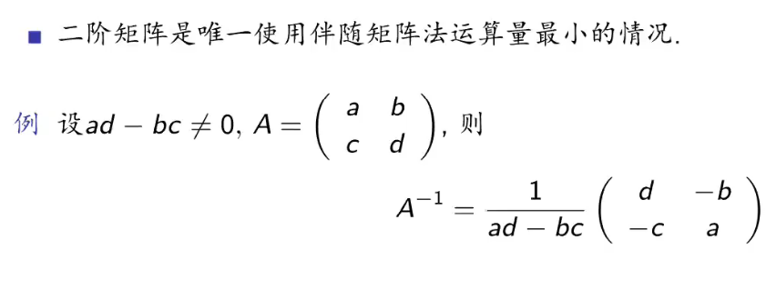

**例2.10**->判断是否可逆 + 求逆矩阵

常规的思路，计算矩阵的行列式，然后代入公式计算。

对于低阶的矩阵伴随矩阵的方法不错，但是高阶的矩阵计算就太复杂了。

**检验逆的时候只用检测一边就可以：**

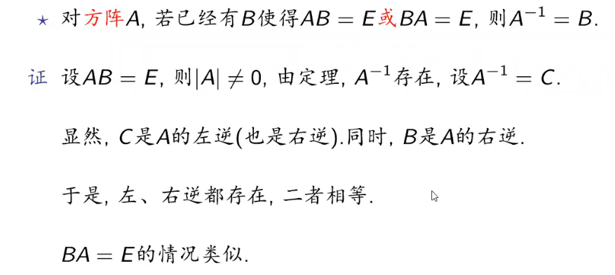

若找到一个矩阵乘积是单位矩阵，那么可逆+逆矩阵找到了

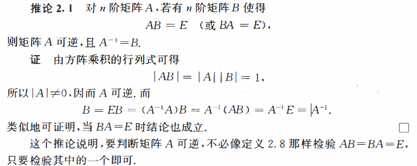

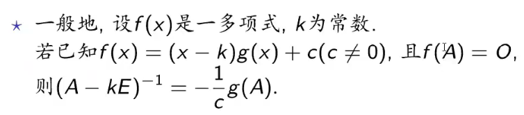

**期末考试题**

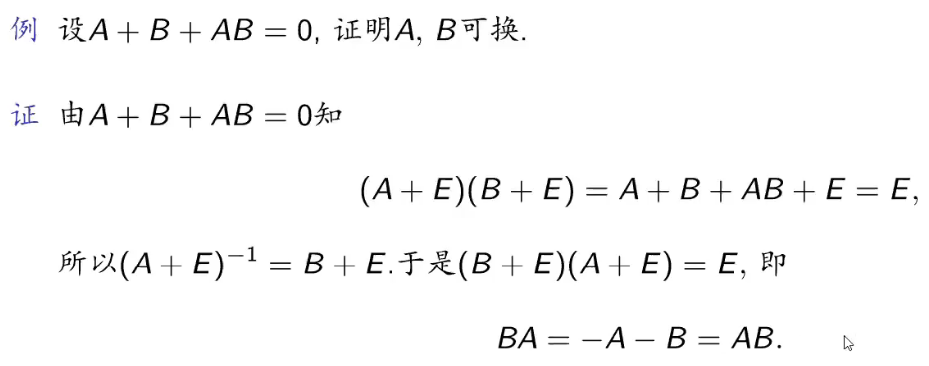

互为逆矩阵，交换乘积里面的逆的位置。

例2.11**->证明表达式可逆，并且给出逆的表达式

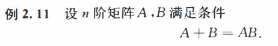

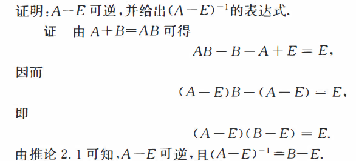

##### 克拉默定理

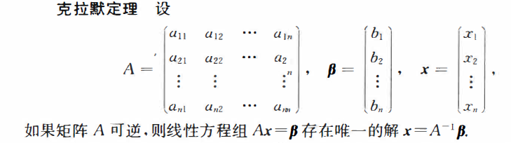

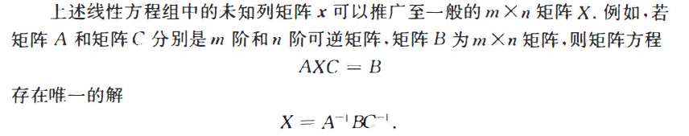

这样的话，求矩阵方程的解的问题转化成**求解矩阵的逆和矩阵乘法的问题**。

**例2.12**->矩阵方程转换，使得未知矩阵单列在一边。

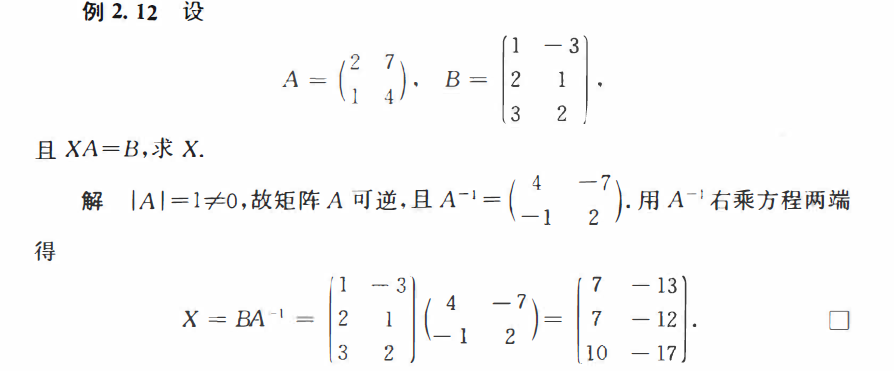

### 可逆矩阵的性质

注意：

- 常数的逆：倒数
- 乘积的逆：左右颠倒位置；多个乘积：直接逆序
- 逆和转置可以交换

**例2.13**->正向利用性质找逆

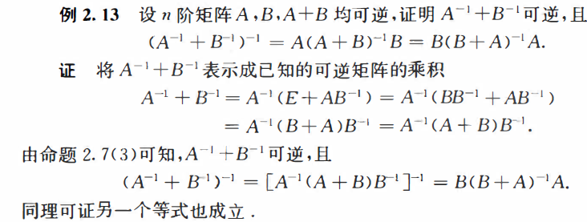

伴随矩阵的性质：

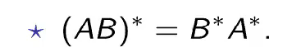

**例2.14**->伴随矩阵的性质

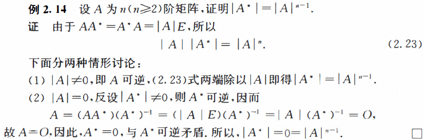

# 第七节课200331

### 分块矩阵

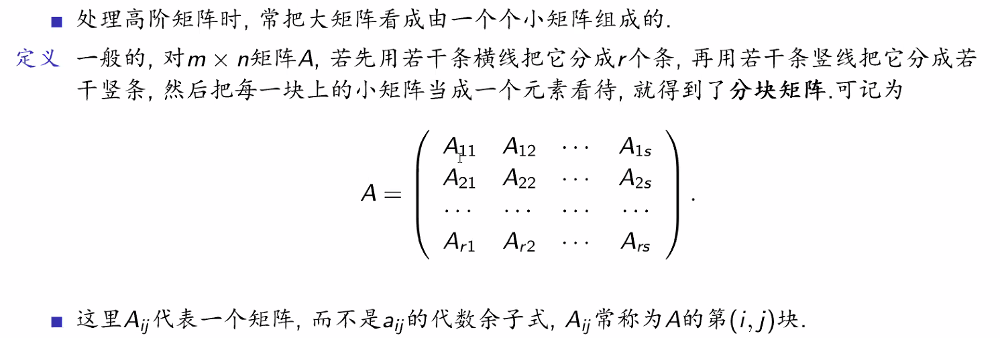

形如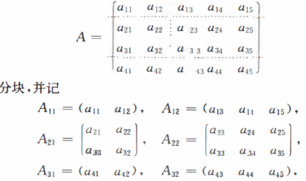

分块矩阵不是代数余子式，是一个块。

##### 分块矩阵的加法

同类型的分块矩阵加法：很显然

##### 分块矩阵乘法

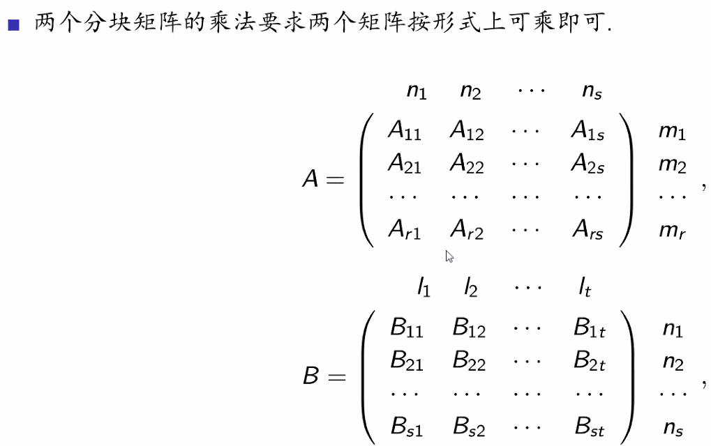

原来就可乘，同时A的列分割和B的行分割一样。

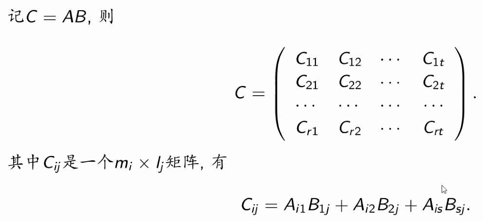

- 分块乘积和不分块的乘积是一样的。

**例2.15**->矩阵自己分块，然后乘积运算


##### 常用的乘法

左乘一行向量-》提取出A的第i行


右乘一列向量-》提取出A的第j列


交换两行元素


k


##### **对角和可逆**


可逆的充要条件，是对角上每个小块都可逆。

##### **转置和共轭**


### 矩阵的初等变换

对于解方程的助益：


##### 行阶梯形矩阵


**任何矩阵**都可以经过单纯的**初等行变换**化为阶梯形矩阵。

**例2.16**->初等行变换的方法

1. 列号最小的非零列，使用行初等变换使得非零元素处在第一行【调整位置到第一个非零行】
2. 将第一行的适当倍数加到其他行，使得第二列从第二行开始所有的元素变为零。
3. 不断重复


##### 简化的阶梯形矩阵（规范的阶梯形矩阵）

1. 每个非零行的第一个非零元素是1
2. 每个非零行的第一个非零元素所在**列的其他元素全为零**

##### 标准形矩阵

非零矩阵的左上角为单位矩阵，其他位置的元素都为零。


**任何矩阵都可以经过单纯的初等行变换 ->简化的阶梯形矩阵**


**任何矩阵都可以经过初等变换->标准形矩阵**（备注：初等变换包括列变换）


任何矩阵经过初等行变换**一定能化为**简化的阶梯形矩阵，但是不一定能化成标准形矩阵。

##### Hermite标准型矩阵


### 矩阵的秩

##### 子式与子矩阵

子式是行列式


**定义：**如果r阶子式不为零，而所有的r+1阶子式都为零，那么r是矩阵A的秩——记为r(A)或者rank(A)

**矩阵A中不为零子式的最高阶数**


##### 矩阵的秩的性质


**阶梯形矩阵的秩等于它非零行的个数**。

方阵中的行（列）满秩矩阵和A为可逆矩阵/非奇异矩阵是等价的概念。

**初等变换不改变矩阵的秩。**

# 第八节课200402

### 初等变换

**初等矩阵：单位矩阵**经过**一次**初等变换得到的矩阵。

单位矩阵变成的形式：


**定理：**左行右列

- 初等矩阵左乘相当于行变换

  

- 初等矩阵右乘相当于列变换


**推论：**初等矩阵都是**可逆矩阵**，并且逆是同类型的初等矩阵。


- 充分性：初等矩阵都是可逆的，乘积也是可逆的。

- 必要性：A可逆->矩阵A可逆的充分必要条件是存在n阶初等矩阵R 1 ,R 2 ,… ,R S 与n阶初等矩阵C1 ,C2, …，C使得
  $$
  Rs… R2 R1 A C1 C2 … Ct =En
  $$
  因而得证。

**推论：**任何一个可逆矩阵A可经单纯的初等行变换化为单位矩阵。


**推论：**秩的推导关系


**例题2.19：**设A为m*n矩阵,

证明：r(A) =1 的充分必要条件是存在m\*1矩阵 a不等于0 与 n\*1 矩阵β不等于0，使得 $A= αβ^T$

**必要性**

**充分性**

### 求逆矩阵的初等变换法


##### **初等变换法**


##### **求解方程**


**例题2.22**可逆矩阵表示成初等矩阵的乘积


关键步骤：

1. 记录行初等变换的步骤
2. 行初等变换使用**初等矩阵的乘积**的方式表达
3. 初等矩阵转换成**矩阵的形式**

##### 矩阵的等价

A经过**有限次初等变换**变为B——A和B等价或者相抵。

等价的矩阵必有**相同的秩与相同的标准形**。

等价矩阵的性质：


1. 自反性
2. 对称性
3. 传递性

